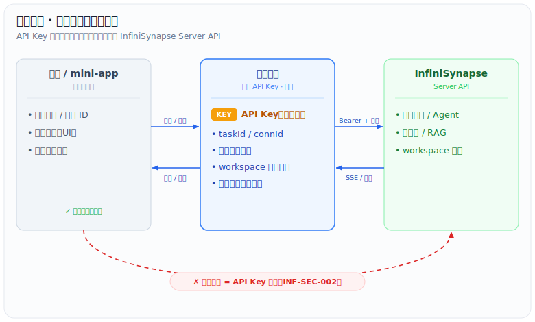

# 安全接入 Playbook

> 特定用法总结：把"基于 InfiniSynapse 开发产品时如何不泄露 API Key、如何托管状态、如何设计恢复"合并成一套默认决策与清单。
> 硬约束原文见 `AGENTS.md` 第 3 节；可跑骨架见 `samples/templates/server-side-agent-flow.md` 与 `samples/sdk/`；端点见 `docs/reference/api-index.md`。

## 一句话规则

API Key 只在服务端；前端只和你的后端通信，由后端持有 Key 并代理 InfiniSynapse。前端永远拿不到 InfiniSynapse 的 Key。

如果产品同时直连 LLM 做轻量调用（见 [llm-routing.md](llm-routing.md)），LLM provider key 也必须只在服务端。直连 LLM 指业务后端直连，不是前端直连。

## 默认架构

```text
前端 / mini-app  →  你的后端（持有 API Key、组装 prompt、转发文件、读产物）  →  InfiniSynapse Server API
```

不要让前端、移动端、桌面端直接调 `app.infinisynapse.cn/api/...`——那等于把 Key 打进可被用户拿到的产物。对应扫描规则 `INF-SEC-001`（硬编码 Bearer）、`INF-SEC-002`（前端直连）。

## API Key 生命周期

| 阶段 | 做法 |
| --- | --- |
| 创建 | 在 `https://app.infinisynapse.cn/tasks` 左下角设置 → **API Key Management** → Create |
| 存储 | 放服务端环境变量或密钥管理系统（KMS / Secrets Manager / Vault），不进代码仓库、不进前端 bundle、不进日志 |
| 使用 | 仅服务端请求带 `Authorization: Bearer <key>`；前端调你自己的业务路由 |
| 轮换 | 定期在 API Key Management 新建并切换；旧 Key 停用 |
| 泄露处理 | 立即在 API Key Management 删除旧 Key 并重建；排查泄露路径（前端/日志/仓库/截图） |

## 服务端必须托管的状态

后端至少落库（不要只放内存，刷新/重启会丢）。下面是一张可直接照搬的"业务任务 ↔ InfiniSynapse 任务"映射表——`docs/proposals/` 的两个产品（求职、项目调研）独立收敛出几乎一致的结构：

| 字段 | 说明 |
| --- | --- |
| `id` | 自有业务任务 ID（主键） |
| `user_id` | 业务用户 ID |
| `task_kind` | 业务任务类型（如 `job_analysis` / `deep_research`） |
| `infini_task_id` | InfiniSynapse `taskId` |
| `infini_conn_id` | InfiniSynapse `connId` |
| `status` | `queued`/`planning`/`waiting_user`/`running`/`completed`/`failed`/`cancelled` |
| `input_json` / `input_hash` | 用户输入快照 + 去重/复用哈希 |
| `uploaded_files` | 本地文件 ↔ sandbox/workspace 路径映射 |
| `workspace_snapshot` | 完成时的 workspace 文件索引 |
| `final_artifacts` | 最终产物路径；成熟产品建议同时保存 provider path、自有 storage key、checksum 和 archive manifest key |
| `plan_audit` | plan/act 审批场景的计划文本、`plan_requested_at`、`plan_approved_at`、`act_sent_at` 或等价字段 |
| `export_status` | `private`/`approved_for_export`/`exported`；业务产品默认发布脱敏副本，不直接公开原始 task（见 [task-sharing.md](task-sharing.md)） |
| `saved_to_rag` | 是否经用户或 Reviewer 批准后 `saveToRag` |
| `error_message` | 错误信息 |

这样刷新页面后能用 `getUiMessageById` + `getTaskWorkspace` 恢复（见 `docs/reference/task-lifecycle.md` 恢复设计）。`samples/templates/server-side-agent-flow.md` 是同一映射的最小骨架版。

## 决策表：什么放服务端，什么能给前端



| 数据 | 位置 | 说明 |
| --- | --- | --- |
| InfiniSynapse API Key | 仅服务端 | 绝不下发 |
| LLM provider API Key | 仅服务端 | 只给轻量 `LlmGateway` 使用，不进前端 bundle |
| `taskId` / `connId` | 服务端落库；可映射成你自己的业务 ID 给前端 | 前端用业务 ID 调你的路由，不直接拿去调 InfiniSynapse |
| SSE 进度 | 服务端消费后转发给前端 | 便于鉴权、限流、审计、恢复 |
| workspace 产物 | 服务端下载后按需透传；关键交付物可归档到自有 artifact store | 下载是二进制，别当 JSON（`INF-DL-001`） |
| 业务结论/展示文本 | 可给前端 | 这是产品输出 |

## 推荐流程（最小安全骨架）

1. 前端把业务表单提交到**你的后端路由**（带你自己的鉴权）。
2. 后端生成 `connId`（需恢复/轮询时也生成 `taskId`），落一条 pending 业务记录。
3. 后端**先连** `GET /api/ai/events?connId=`，**再发** `POST /api/ai/message`(`newTask`)。
4. 后端把 SSE 转成前端可见的进度/结构化结果（不透传原始 Key 相关信息）。
5. Agent 请求上传时，后端 `POST /api/ai/upload?taskId=`，再 `askResponse` 回传。
6. 完成后后端读 `getTaskWorkspace` + `downloadTaskFile`，落库产物路径；正式产品的关键交付物复制到自有 artifact store，写入 archive manifest 后再按权限透传给前端（见 [artifact-archiving.md](artifact-archiving.md)）。
7. 用户中止 → 后端调用 `/api/ai/message` `type=cancelTask`，并在业务库标记状态。
8. 后端设置业务总超时/调用预算；超时或失败时先 `cancelTask`，再尝试用 `getTaskWorkspace` 恢复已有产物并按 schema 校验，避免任务继续消耗或丢失可用结果。

两段式审批场景里，后端在 plan 完成后可以暂停消费进入 `waiting_user`；用户 approve 后、发送 `togglePlanActMode`/`askResponse` 前，需要重新建立或确认 SSE consumer，继续由后端消费 act 阶段事件。

可直接抄 `samples/sdk/typescript/examples/express-proxy.ts`（含上述全部）。

## 常见反模式

- 前端 `fetch("https://app.infinisynapse.cn/api/ai/message", { headers:{ Authorization:`Bearer ${KEY}` }})`——Key 进 bundle。
- 把 Key 写进 `NEXT_PUBLIC_*` / 移动端配置 / 客户端可读的任何位置。
- 在日志/错误上报里打印完整 token。
- 只在内存存 `taskId`/`connId`，重启或多实例后无法恢复。
- 没有业务总超时和取消策略，Agent 在长文件截断/补写循环里持续消耗调用。
- 含上传材料的业务任务直接 `setShare` 公开；如果只想公开部分报告，应走自有脱敏导出。
- 只把最终文件留在 provider workspace，不做自有归档，却把它当成产品历史下载和合规留存的唯一来源。
- 私有化部署把 `AUTHING_SERVER_URL` 配错导致登录失败（见 `troubleshooting.md`、`INF-ENV-*`）。

## 检查清单

- API Key 是否只在服务端、且来自密钥管理而非硬编码？
- 前端是否只和你自己的后端通信，从不直连 InfiniSynapse？
- `taskId`/`connId`/上传映射/产物路径是否落库（可恢复）？
- plan/act 场景下 `waiting_user` 是否落库并参与并发限制、取消和恢复？
- 是否先连 SSE 再发 `newTask`？
- 下载是否按二进制处理？
- 关键交付物是否已按业务权限归档到自有 artifact store？
- 分享状态是否区分"原始 task public"和"自有脱敏 export"？
- 日志是否屏蔽了 token / 数据库密码 / Mongo URI / Redis 密码 / JWT secret？
- 跑过 `npm run scan -- <file>`，无 `INF-SEC-*` 命中？
