# Chrome Plugin Install

# 如何安装Browser Use浏览器插件

## 什么是 Browser Use 功能？

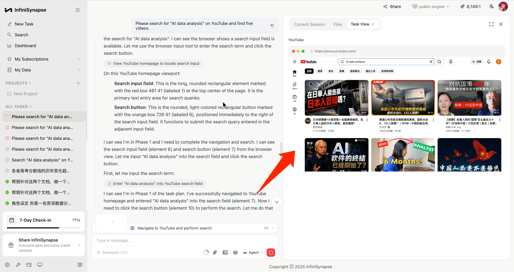

InfiniSynapse 的 **Browser Use** 功能，让 AI 能够像真人一样操作浏览器，帮你自动完成各种网页任务：

✅ **自动化数据采集**：批量爬取网页数据，无需手动复制粘贴\
✅ **智能表单填写**：自动填写重复性表单，节省大量时间\
✅ **网页内容提取**：从复杂页面中精准提取所需信息\
✅ **多步骤操作**：自动执行登录、搜索、点击等复杂流程

要使用这个强大的功能，你需要先安装 InfiniSynapse 浏览器扩展。下面提供两种安装方法，任选其一即可。

------------------------------------------------------------------------

## 方法一：从产品首页下载（推荐）

首先，在首页（<https://app.infinisynapse.cn/tasks>），点击「安装浏览器扩展」，就会看到一个弹窗，选择「下载 CRX 安装」。

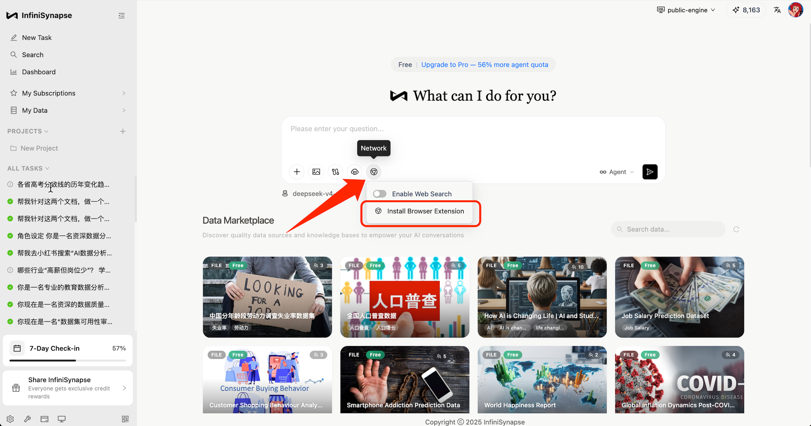

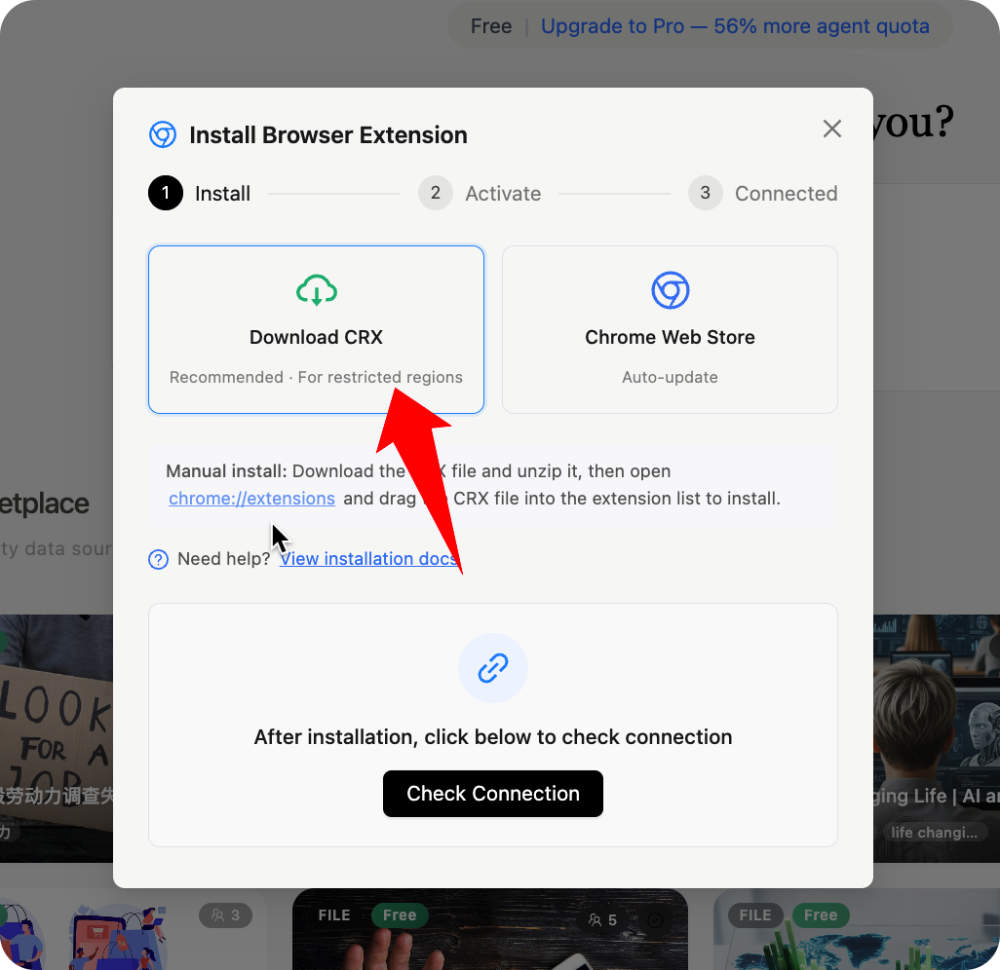

点击下载后，在浏览器的下载列表就可以看到插件压缩包，解压该压缩包。

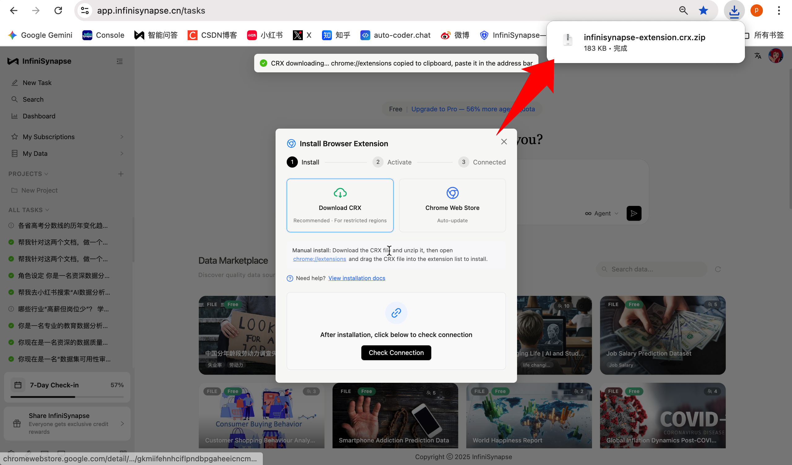

点击浏览器右上角省略号-\> 扩展程序-\> 管理扩展程序。

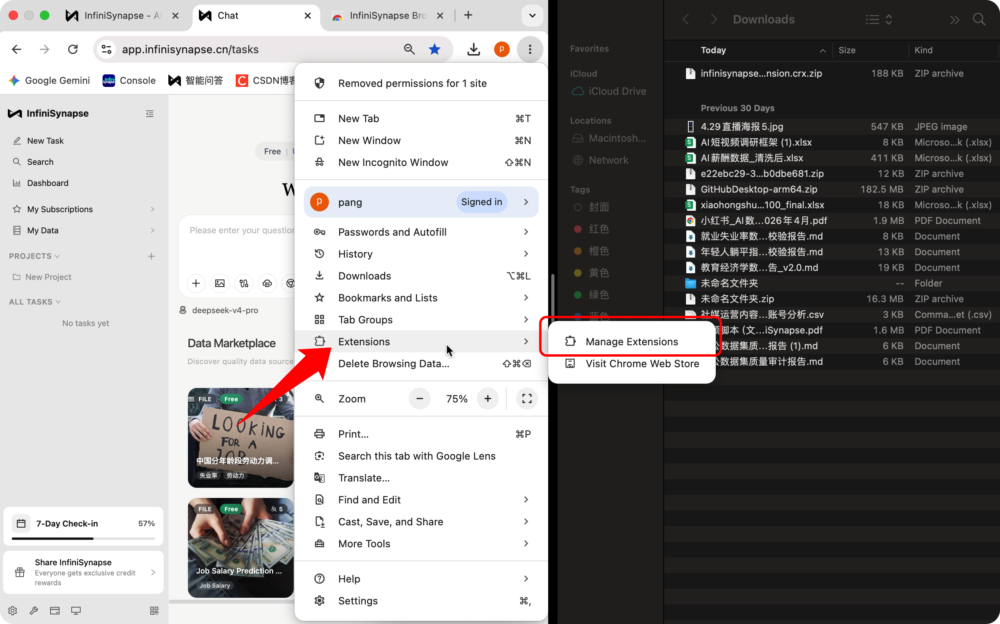

然后把解压后的 CRX 文件拖拽到浏览器里。

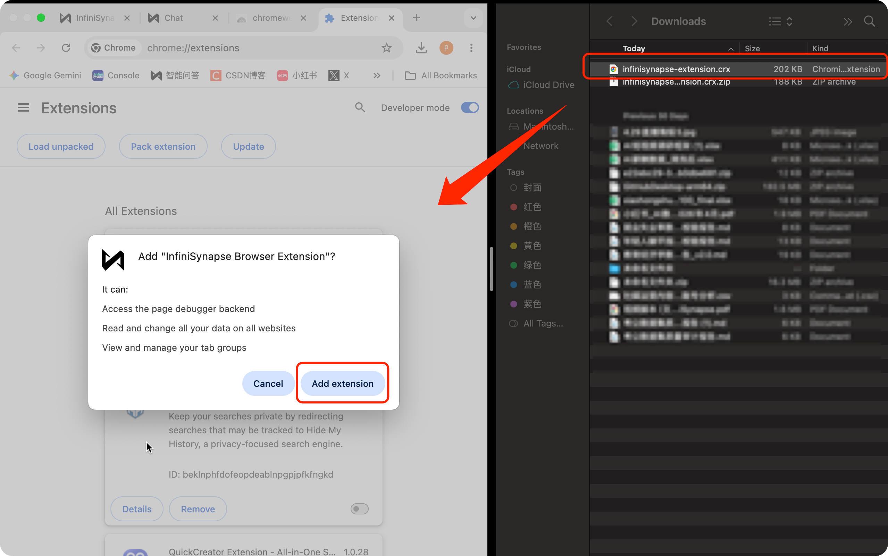

此时会弹出一个弹框，点击弹窗里的「添加扩展程序」，即可安装完成。

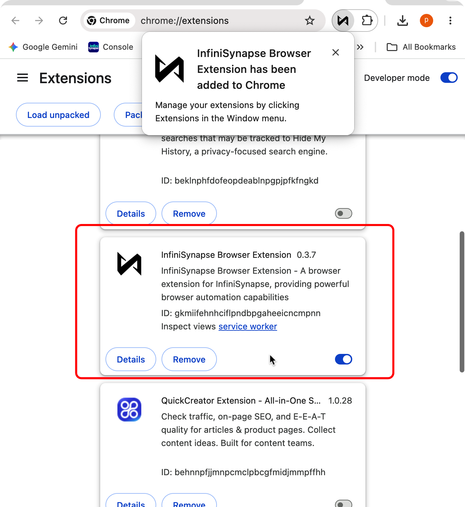

回到产品首页（<https://app.infinisynapse.cn/tasks>），就能看到「启用浏览器」的按钮被打开了，你就可以使用浏览器功能了！

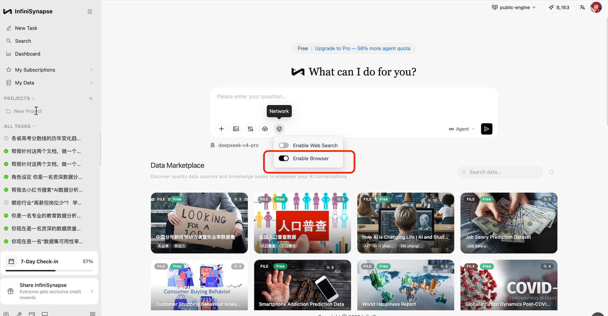

## 方法二：官网下载

去到 InfiniSynapse 官网（<https://www.infinisynapse.cn/>），点击「下载 Chrome 插件」。

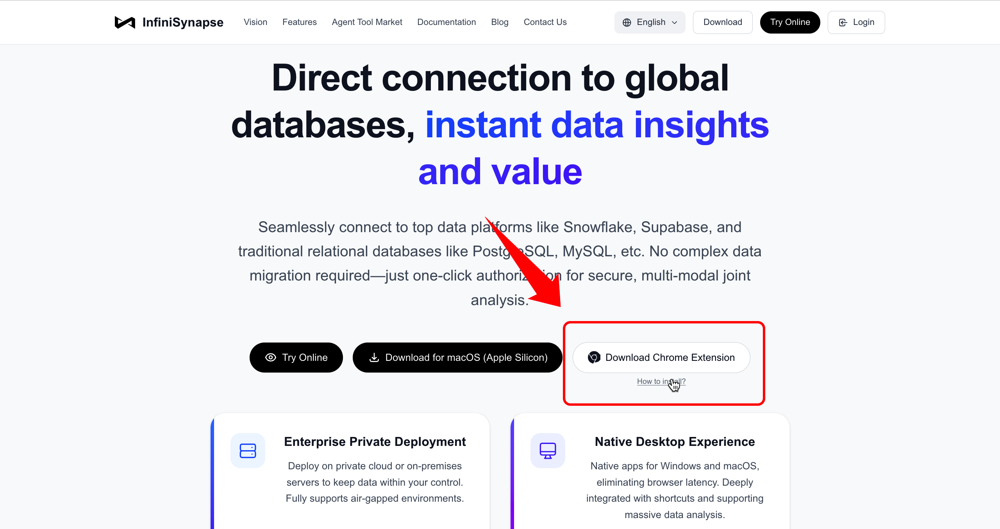

能看到 CRX 文件被下载到本地：

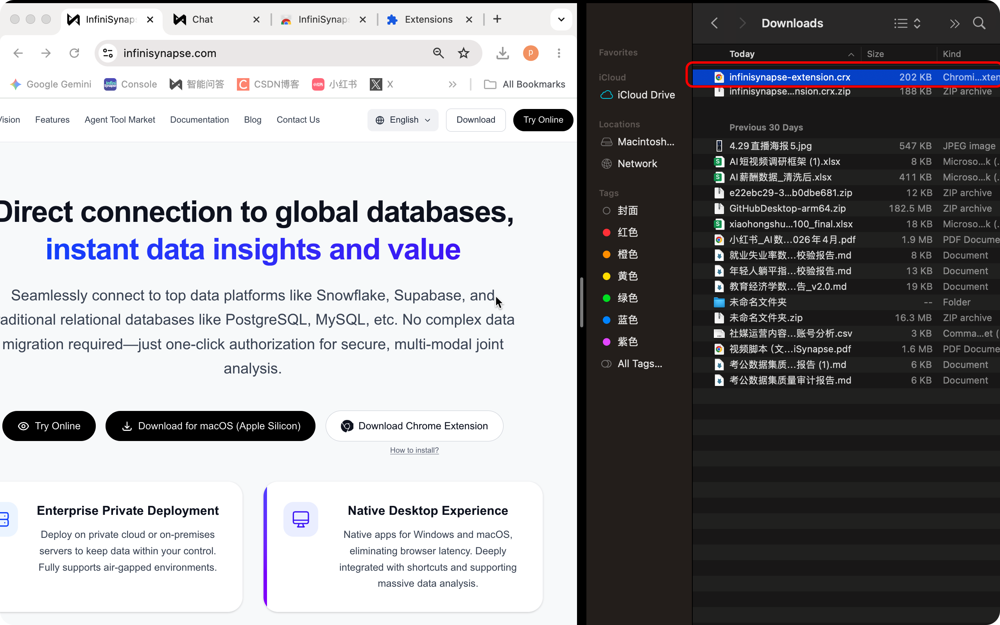

点击浏览器右上角省略号-\> 扩展程序-\> 管理扩展程序，然后直接把本地的 CRX 文件拖拽到浏览器里。

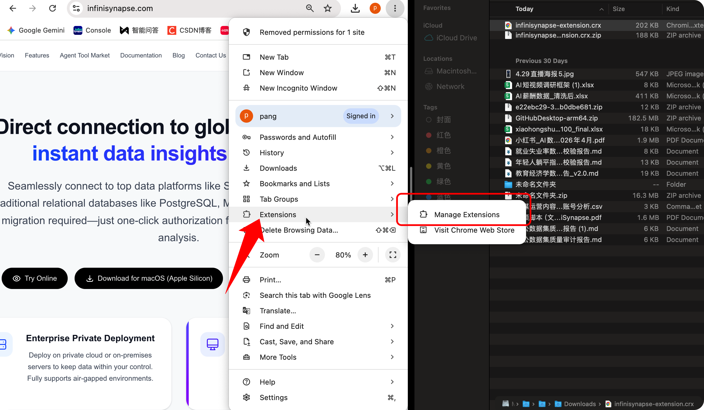

此时会弹出一个弹框，点击「添加扩展程序」，即可安装完成。

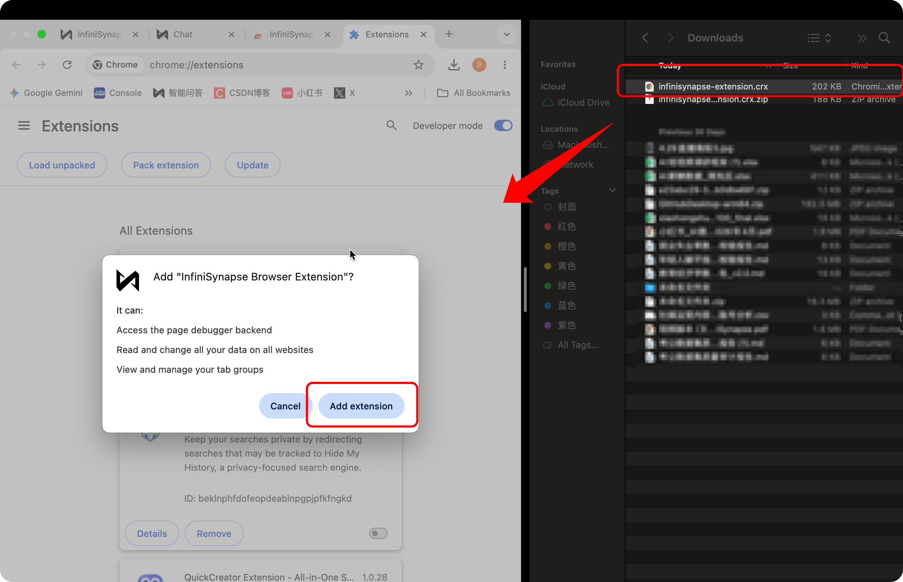

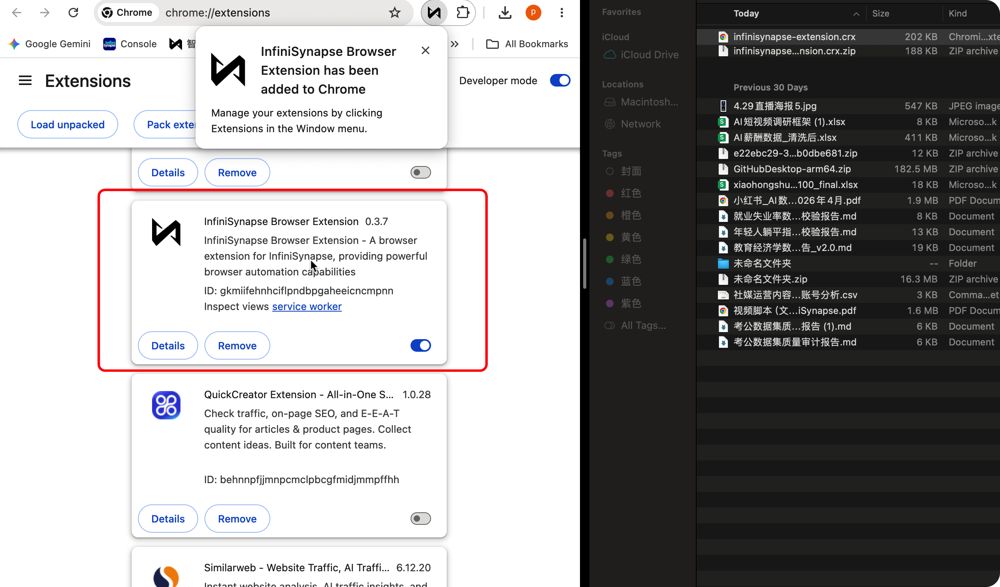

回到产品首页（<https://app.infinisynapse.cn/tasks>），就能看到「启用浏览器」的按钮被打开了，你就可以使用浏览器功能了！

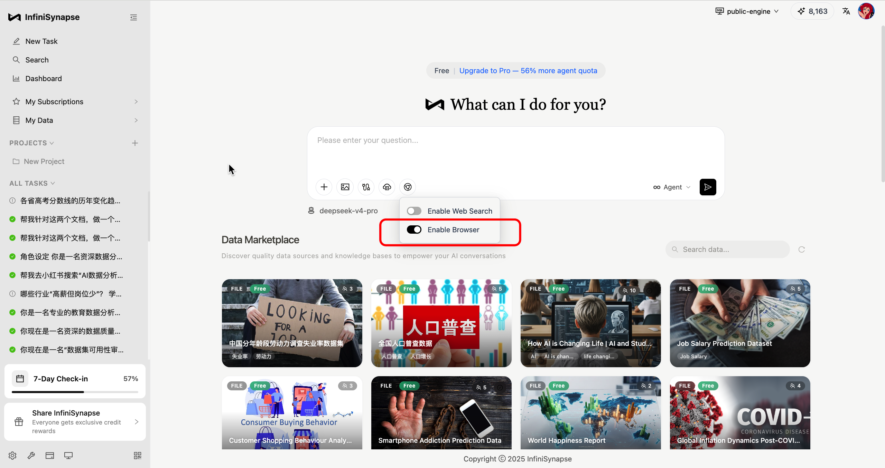
