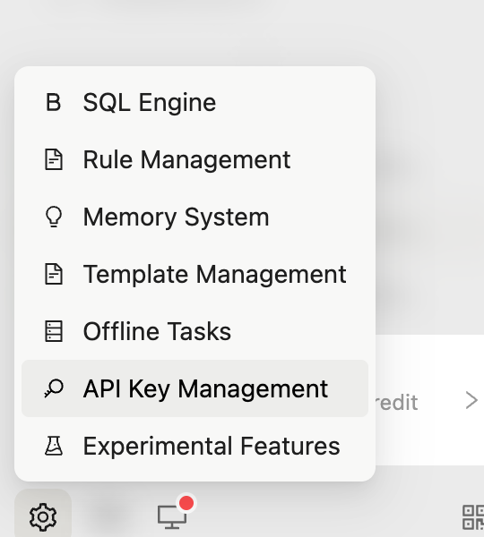
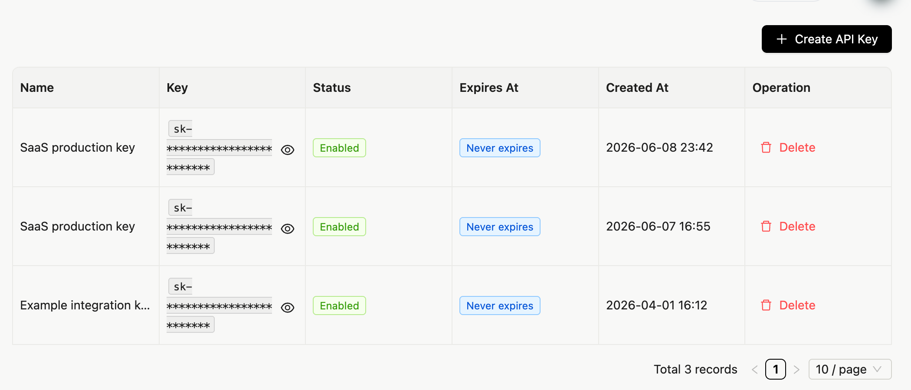
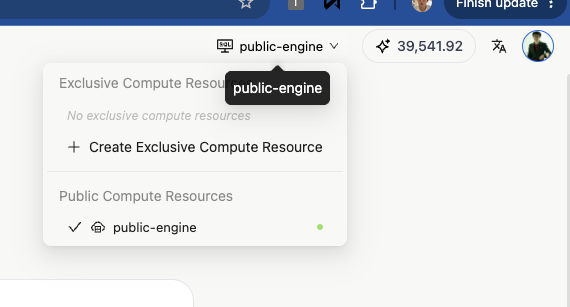

# InfiniSynapse Server API Reference


本文是 InfiniSynapse 服务端（Server）面向外部用户/SDK 的 HTTP API 参考。通过一个 API Key（Bearer Token）即可直接调用，完成多轮 AI 任务对话、数据源管理、RAG 知识库管理、Skill 管理、文件上传与下载等操作，无需依赖前端界面。

> 仅需命令行集成的用户，可优先查阅《InfiniSynapse CLI API Reference》；本文面向需要直接发起 HTTP 请求的开发者。

## 1. 接入准备

### 基础信息

| 项 | 值 |
|----|----|
| 基础地址（国内） | `https://app.infinisynapse.cn` |
| 基础地址（海外） | `https://app.infinisynapse.com` |
| 账号/市场 API 基础地址（国内） | `https://api.infinisynapse.cn/api` |
| 账号/市场 API 基础地址（海外） | `https://api.infinisynapse.com/api` |
| 全局路径前缀 | 所有接口均以 `/api` 开头 |
| 鉴权方式 | HTTP 头 `Authorization: Bearer <API Key>` |
| 默认内容类型 | `application/json`（文件上传为 `multipart/form-data`） |

> 国内用户请使用 `.cn` 域名，海外用户请使用 `.com` 域名；私有化部署时替换为你自己的服务地址。下文示例统一以 `.cn` 域名书写，海外环境将其替换为 `.com` 即可。

### 鉴权

所有业务接口都需要在请求头携带 Bearer Token：

```
Authorization: Bearer <你的 API Key>
```


服务端从 Token 的 `sub` 声明中解析出用户身份（`userId`），所有资源（任务、数据源、知识库、文件）都按用户隔离。少数标注「公开只读」的接口无需鉴权。

### 获取 InfiniSynapse SaaS API Key

开发者可以在 InfiniSynapse SaaS 控制台生成或查看自己的 API Key：

1.  打开并登录 <https://app.infinisynapse.cn/tasks>。
2.  点击左下角「设置」齿轮图标，在弹出的菜单中选择 **API Key Management**。



3.  进入 **API Key Management** 页面后，点击 **Create API Key** 创建新的 Key；也可以在列表中查看已有 Key 的名称、状态、过期时间和创建时间。
4.  将获取到的 Key 作为 Bearer Token 放入请求头：`Authorization: Bearer <你的 API Key>`。



> 截图中的 Key 已做脱敏处理。请将 SaaS API Key 保存在服务端或安全的密钥管理系统中，不要写入前端代码、公开仓库或客户端配置；如果 Key 泄露，应在 **API Key Management** 中删除旧 Key 并重新创建。

### 将 `/tasks` 作为开发者后台

对开发者而言，<https://app.infinisynapse.cn/tasks> 也可以作为 SaaS API 调用的后台控制台：

- 自己开发的应用通过 Server API 发往 InfiniSynapse 后端的任务，都会出现在左侧 **ALL TASKS** 列表中，便于回看任务状态、消息记录、执行过程和任务工作区产物。
- 控制台右上角可查看账户额度并进行充值，也可以切换或配置计算资源。
- 默认的 `public-engine` 是公共计算资源；如果应用需要更稳定的配额、资源隔离或独占执行环境，可以点击右上角当前计算资源（如 `public-engine`）下拉菜单，选择 **Create Exclusive Compute Resource** 创建独占计算资源。创建完成后，可在同一菜单中切换到自己的独占资源。



### 语言

可选请求头 `x-lang` 控制服务端返回的提示文案语言，取值：`zh_CN`（默认）、`en`、`ar`、`ja`、`ko`、`ru`。

```
x-lang: zh_CN
```


### 统一响应结构

绝大多数接口返回统一信封：

```
{
  "code": 200,
  "message": "success",
  "data": { }
}
```


- `code === 200` 表示成功，业务数据在 `data` 中。
- `code` 为 `1101` / `1105`：Token 过期或失效，需更换 API Key。
- 参数校验失败返回 HTTP `422`，`message` 为第一条校验错误信息。
- 文件下载类接口直接返回二进制流（`application/octet-stream` 或 `application/zip`），不走该信封。

### 分页约定

列表类接口（继承自通用分页参数）支持以下 Query 参数：

| 参数       | 类型   | 默认 | 说明                                           |
|------------|--------|------|------------------------------------------------|
| `page`     | number | 1    | 页码（从 1 开始）                              |
| `pageSize` | number | 10   | 每页条数（一般上限 100，数据源列表上限 10000） |
| `field`    | string | \-   | 排序字段，如 `updated_at`                      |
| `order`    | string | desc | 排序方向 `asc` / `desc`                        |

分页响应的 `data` 结构：

```
{
  "items": [ ],
  "meta": {
    "itemCount": 10,
    "totalItems": 42,
    "itemsPerPage": 10,
    "totalPages": 5,
    "currentPage": 1
  }
}
```


### 快速开始示例

```
curl -X GET "https://app.infinisynapse.cn/api/ai_database/list?page=1&pageSize=10&source=all" \
  -H "Authorization: Bearer <你的 API Key>" \
  -H "x-lang: zh_CN"
```


## 2. AI 对话与任务执行

AI 对话采用「SSE 长连接 + 消息投递」的异步模式：先订阅事件流接收实时推送，再通过消息接口发送指令。

### 2.1 订阅事件流（SSE）

- **`GET /api/ai/events`**
- 建立 Server-Sent Events 长连接，服务端主动推送消息变更、状态就绪、通知等。

**Query 参数**

| 参数 | 必填 | 说明 |
|----|----|----|
| `connId` | 否 | 客户端生成的连接 ID（如 UUID）；多 Tab/多连接时各用一个，便于服务端定向推送。不传则服务端自动生成 |

**请求头**：`Authorization: Bearer <token>` 必填，建议带 `Accept: text/event-stream`。

**事件类型**（每条格式为 `event: <event>\ndata: <JSON>\n\n`）

| event | data | 说明 |
|----|----|----|
| `message.add` | `{ taskId, message }` | 向任务追加一条消息 |
| `message.update` | `{ taskId, message }` | 更新已有消息 |
| `message.partial` | `{ taskId, message }` | 流式增量更新（同 ts 覆盖或追加） |
| `message.remove` | `{ taskId, messageTs: number[] }` | 移除指定消息 |
| `state.ready` | `{ taskId }` | 状态就绪，建议随后调用 `/api/ai_task/tasks` 全量拉取 |
| `notification` | `{ type, title, message, duration? }` | 全局通知 |
| `heartbeat` | `"ping"` | 保活，可忽略 |

**Agent 消息字段**

mini-app 或 SDK 通常只需要消费 `message.add` / `message.partial` 中的 `data.message`：

| 字段 | 示例 | 说明 |
|----|----|----|
| `message.type` | `say` / `ask` | `say` 表示 Agent 输出，`ask` 表示 Agent 等待客户端响应 |
| `message.text` | `"..."` | 流式文本或最终文本；`partial=true` 时为增量/覆盖内容 |
| `message.say` | `completion_result` | 任务完成信号之一 |
| `message.ask` | `completion_result` | 任务完成信号之一 |
| `message.ask` | `upload_file_to_sandbox` | Agent 请求客户端把本地文件上传到当前任务沙箱；上传后用 `askResponse` 把上传结果发回 |

```
curl -N "https://app.infinisynapse.cn/api/ai/events?connId=550e8400-e29b-41d4-a716-446655440000" \
  -H "Authorization: Bearer <你的 API Key>" \
  -H "Accept: text/event-stream"
```


### 2.2 发送消息

- **`POST /api/ai/message`**
- 根据 body 的 `type` 分发到不同逻辑。回复实时推送到 SSE 通道，本接口本身仅返回执行结果。

**常用 `type` 及字段**

| type | 必填字段 | 可选字段 | 说明 |
|----|----|----|----|
| `newTask` | `text` | `taskId`、`connId`、`images`、`files`、`autoApprovalSettings`、`chatSettings` | 新建任务（会做数据源扣费校验与幂等）。服务端可自动生成 `taskId`，也支持客户端预生成 UUID 以便并发场景准确轮询 |
| `askResponse` | `taskId`、`askResponse` | `text`、`images`、`files`、`connId` | 回复 Agent 的提问，继续多轮对话；`askResponse` 一般为 `messageResponse` |
| `cancelTask` | `taskId` | \- | 取消运行中的任务 |
| `clearTask` | \- | `taskId` | 清除任务；不传 `taskId` 清空全部 |
| `optionsResponse` | `taskId`、`connId`、`text` | \- | 多选项回复 |
| `togglePlanActMode` | `chatSettings` | `taskId` | 切换规划/执行模式 |
| `autoApprovalSettings` | `autoApprovalSettings` | \- | 更新自动审批配置 |
| `rollbackToSnapshot` | `taskId`、`snapshotTs` | \- | 回滚到指定快照 |
| `rollbackAndSendMessage` | `taskId`、`snapshotTs`、`text` | `images`、`files` | 回滚并发送新消息 |
| `editFirstMessageAndResend` | `taskId`、`text` | `images`、`files` | 编辑首条消息并重新执行 |

**响应**

- 成功通常为 `{ "success": true }`；
- `newTask`、回滚、编辑首条等会附带 `{ success: true, state, forceReplace? }`；
- 失败可能为 `{ success: false, error }` 或 `{ success: false, notification: { type, title, message } }`（如扣费校验失败）。

```
# 新建任务
curl -X POST "https://app.infinisynapse.cn/api/ai/message" \
  -H "Authorization: Bearer <你的 API Key>" \
  -H "Content-Type: application/json" \
  -d '{"type":"newTask","text":"分析最近一个月的销售趋势","connId":"550e8400-..."}'

# 多轮追问
curl -X POST "https://app.infinisynapse.cn/api/ai/message" \
  -H "Authorization: Bearer <你的 API Key>" \
  -H "Content-Type: application/json" \
  -d '{"type":"askResponse","taskId":"task-001","askResponse":"messageResponse","text":"再按地区拆分"}'
```


**mini-app / Agent 集成建议流程**

1.  客户端生成 `connId`；如需要并发安全或后续轮询稳定，也生成 `taskId`。
2.  先建立 `GET /api/ai/events?connId=<uuid>`，等待 `state.ready` 或短暂超时。
3.  调用 `POST /api/ai/message`，`type=newTask`，带上同一个 `connId`、任务 `text`、可选 `taskId`、`images`、`autoApprovalSettings` 和 `chatSettings: { "mode": "act" }`。
4.  从 SSE 的 `message.partial` / `message.add` 读取进度；`notification.type=error` 应视为任务失败。
5.  如果收到 `message.type=ask` 且 `message.ask=upload_file_to_sandbox`，先上传文件，再用 `type=askResponse`、`askResponse=messageResponse`、同一个 `taskId` 和 `connId` 把上传结果 JSON 发回。
6.  收到 `message.ask=completion_result` 或 `message.say=completion_result` 后，再用任务文件接口读取报告、图表、PDF、Word 等产物。

### 2.3 其他对话辅助接口

| 接口 | 方法 | 说明 |
|----|----|----|
| `/api/ai/state?taskId=` | GET | 获取指定任务（或全局）的完整前端状态：apiConfiguration、当前任务、消息列表、自动审批、对话模式、todo 等 |
| `/api/ai/settings` | POST | 更新 API 配置、自定义说明、自动审批设置；传 `taskId` 时同时更新该任务的模型 |
| `/api/ai/configuration` | GET | 获取当前用户保存的 `apiConfiguration` |
| `/api/ai/models` | GET | 按当前 API 配置请求 OpenAI 兼容 `/models`，返回可用模型 ID 数组 |
| `/api/ai/ping` | GET | 轻量心跳，返回 `{ ok: true }`，用于探测连接存活 |
| `/api/ai_browser/session` | GET | 获取当前用户已连接的浏览器插件会话 `{ uid, clientId, status, connectedAt, lastActivityAt, browserName, version, activeSessionCount, activeSessionIds }`；购物/网页研究类应用可用它确认 Chrome 插件是否在线 |

## 3. 任务管理

控制器前缀：`/api/ai_task`。

### 3.1 任务查询

| 接口 | 方法 | 参数 | 说明 |
|----|----|----|----|
| `/api/ai_task/list` | GET | 分页参数 + `task_name`、`category_name`、`category_id`、`is_in_rag`、`virtual_echart_category`（均可选，模糊匹配） | 分页获取任务列表 |
| `/api/ai_task/tasks?taskId=` | GET | `taskId`（必填） | 获取任务完整数据（`taskInfo` + `messages` + `isRunning`） |
| `/api/ai_task/getTaskInfo/:id` | GET | 路径 `id` | 获取任务元信息（不创建运行实例） |
| `/api/ai_task/showTaskWithId/:id` | GET | 路径 `id` | 获取任务详情 |
| `/api/ai_task/getUiMessageById?id=` | GET | `id`（任务 ID） | 获取任务的 UI 消息列表（已瘦身） |
| `/api/ai_task/messagePayload?taskId=&messageTs=` | GET | `taskId`、`messageTs` | 获取单条消息的完整 `text`（未瘦身） |
| `/api/ai_task/getTaskWorkspace/:id` | GET | 路径 `id` | 获取任务工作目录及文件列表 `{ cwd, files }` |

### 3.2 任务操作

#### 删除任务

- **`POST /api/ai_task/deleteTaskWithId`**

```
{ "ids": ["task-001", "task-002"] }
```


#### 取消任务

- **`GET /api/ai_task/cancelTask?taskId=task-001`** 或 **`POST /api/ai_task/cancelTask?taskId=task-001`**

`taskId` 作为 Query 参数传入。部分服务端 mini-app 为了与自己的 `DELETE` 业务路由衔接，会向 InfiniSynapse 后端发起 `POST`；旧客户端也可能使用 `POST /api/ai/message` + `type=cancelTask`。

#### 重新运行 SQL 任务

- **`POST /api/ai_task/rerunSqlTask`**

```
{ "id": "task-001", "chat_index": 0 }
```


#### 运行提取的 SQL

- **`POST /api/ai_task/runExtractSql`**

```
{
  "variables": { "startDate": "2024-01-01", "endDate": "2024-12-31" },
  "register_tables": "orders,users",
  "databases": "main_db",
  "sqls": "SELECT * FROM orders WHERE created_at BETWEEN :startDate AND :endDate"
}
```


### 3.3 任务与 RAG

| 接口 | 方法 | 请求体/参数 | 说明 |
|----|----|----|----|
| `/api/ai_task/saveToRag` | POST | `{ taskId, action }`，`action` 为 `save`/`remove` | 保存或移除任务到 RAG |
| `/api/ai_task/isSavedToRag?taskId=` | GET | `taskId` | 返回布尔值，任务是否已保存到 RAG |

### 3.4 任务分类

| 接口 | 方法 | 请求体/参数 | 说明 |
|----|----|----|----|
| `/api/ai_task/category/add` | POST | `{ category_name }` | 添加分类 |
| `/api/ai_task/category/update` | POST | `{ id, category_name }` | 更新分类 |
| `/api/ai_task/category/delete` | POST | `{ ids: [] }` | 删除分类 |
| `/api/ai_task/category/list` | GET | 分页参数 + `category_name` | 分页获取分类 |
| `/api/ai_task/category/getAllCategories` | GET | \- | 获取全部分类 |
| `/api/ai_task/getCatetoryById/:id` | GET | 路径 `id` | 分类详情 |
| `/api/ai_task/getCatetoryByTaskId/:id` | GET | 路径 `id`（任务 ID） | 获取任务关联分类 |
| `/api/ai_task/updateCategoryByTaskId` | POST | `{ id, category_ids: [] }` | 更新任务关联分类 |

### 3.5 任务文件

| 接口 | 方法 | 请求体/参数 | 说明 |
|----|----|----|----|
| `/api/ai_task/previewFile` | POST | `{ taskId, fileName }` | 预览文件内容，返回 `{ content, fileType }` |
| `/api/ai_task/getTaskWorkspace/:id` | GET | 路径 `id` | 获取任务工作目录及扁平文件列表 `{ cwd, files }`，通常先用它发现生成的 `.md`、`.pdf`、`.docx`、图表文件 |
| `/api/ai_task/downloadZip?taskId=` | GET | `taskId` | 下载整个任务目录为 ZIP（返回二进制流） |

### 3.6 任务分享（公开只读，无需鉴权）

| 接口 | 方法 | 说明 |
|----|----|----|
| `/api/ai_task/setShare` | POST | `{ taskId, isPublic }` 设置任务公开/私有（需所有者鉴权） |
| `/api/ai_task/shareStatus?taskId=` | GET | 查询分享状态（需所有者鉴权） |
| `/api/ai_task/publicTask?taskId=` | GET | 公开只读获取任务数据 |
| `/api/ai_task/publicMessagePayload?taskId=&messageTs=` | GET | 公开只读获取单条消息完整内容 |
| `/api/ai_task/publicTaskFileTree/:taskId` | GET | 公开只读获取文件树 |
| `/api/ai_task/publicPreviewFile` | POST | 公开只读预览文件 |
| `/api/ai_task/publicDownloadTaskFile/:taskId?path=` | GET | 公开只读下载文件 |
| `/api/ai_task/publicDownloadZip?taskId=` | GET | 公开只读下载任务 ZIP |

## 4. 数据源管理

控制器前缀：`/api/ai_database`。支持的数据库类型：`mysql`、`postgres`、`sqlite`、`sqlserver`、`clickhouse`、`snowflake`、`doris`、`starrocks`、`gbase`、`kingbase`、`dm`、`supabase`、`deltalake`、`file`（测试连接还支持 `mongodb`、`elasticsearch`）。

### 4.1 列表查询

- **`GET /api/ai_database/list`**

**Query 参数**：分页参数 + 以下可选项

| 参数 | 说明 |
|----|----|
| `name` | 数据库名称（模糊） |
| `type` | 数据库类型 |
| `enabled` | 是否启用：`1` / `0` |
| `source` | 来源：`local` / `remote` / `subscribed` / `all`（默认 `all`） |
| `subscribeSource` | 订阅来源：`created` / `subscribed` / `all`（默认 `created`） |

### 4.2 增删改

| 接口                       | 方法 | 请求体                       | 说明           |
|----------------------------|------|------------------------------|----------------|
| `/api/ai_database/add`     | POST | `DatabaseAddDto`             | 创建数据库连接 |
| `/api/ai_database/update`  | POST | `DatabaseEditDto`（含 `id`） | 更新数据库配置 |
| `/api/ai_database/delete`  | POST | `{ ids: [] }`                | 批量删除       |
| `/api/ai_database/enabled` | POST | `{ ids: number[], enabled }` | 批量启用/禁用  |

`add` 请求体示例：

```
{
  "name": "production_db",
  "type": "mysql",
  "config": "{\"mysql_host\":\"127.0.0.1\",\"mysql_port\":3306,\"mysql_username\":\"root\",\"mysql_password\":\"***\",\"mysql_database\":\"sales\"}",
  "enabled": 1,
  "description": "生产环境数据库",
  "nickname": "销售数据源"
}
```


> 注意：数据库 `name` 不能以 `remote_` 或 `subscribe_` 开头。

### 4.3 连接测试与查询

| 接口 | 方法 | 请求体/参数 | 说明 |
|----|----|----|----|
| `/api/ai_database/testConnection` | POST | `{ type, config }` | 测试连接，返回 `{ success, message, latencyMs }` |
| `/api/ai_database/getDatabaseById/:id` | GET | 路径 `id` | 按 ID 查询详情 |
| `/api/ai_database/getDatabaseByName/:name` | GET | 路径 `name` | 按名称查询详情 |

### 4.4 文件与知识库绑定

| 接口 | 方法 | 请求体/参数 | 说明 |
|----|----|----|----|
| `/api/ai_database/upload/:databaseId` | POST | `multipart/form-data`，字段 `file`（≤1GB） | 上传数据文件到指定数据库 |
| `/api/ai_database/bindRags` | POST | `{ databaseId, ragIds: [] }` | 设置数据库关联的知识库 |
| `/api/ai_database/getBindRags/:databaseId` | GET | 路径 `databaseId` | 获取数据库绑定的知识库列表 |

### 4.5 数据源市场订阅

共享数据源的发现、订阅和详情查询属于账号/市场 API，国内基础地址为 `https://api.infinisynapse.cn/api`，海外基础地址为 `https://api.infinisynapse.com/api`。鉴权同样使用登录态或访问令牌形式的 `Authorization: Bearer <token>`。

| 接口 | 方法 | 参数/请求体 | 说明 |
|----|----|----|----|
| `/database-market/my` | GET | 分页参数 + `keyword` | 查询当前账号已拥有或已订阅的数据源市场条目 |
| `/database-market/public` | GET | 分页参数 + `keyword` | 查询公开数据源市场条目 |
| `/database-market/is-subscribed/:databaseMarketId` | GET | 路径 `databaseMarketId` | 判断当前账号是否已订阅该数据源 |
| `/database-market/detail/:databaseMarketId` | GET | 路径 `databaseMarketId` | 获取数据源市场详情，可用于确认价格、名称、描述和审批快照 |
| `/database-market/subscribe` | POST | `{ "database_market_id": "<databaseMarketId>" }` | 订阅数据源；如果返回 `orderId`、`url` 或 `paymentUrl`，通常表示需要支付或进一步确认 |

自动化订阅时建议先查 `my`，再查 `public`；只对确认免费的市场条目自动调用 `subscribe`。订阅完成后，再回到 Server API 使用 `GET /api/ai_database/list?source=all&subscribeSource=all&name=<name>` 查找用户空间中的数据源，并用 `POST /api/ai_database/enabled` 启用。

## 5. RAG 知识库管理

控制器前缀：`/api/ai_rag_sdk`。

### 5.1 查询

| 接口 | 方法 | 参数 | 说明 |
|----|----|----|----|
| `/api/ai_rag_sdk` | GET | 分页参数 + `keyword`、`enabled`、`source`、`subscribeSource` | 分页获取知识库列表 |
| `/api/ai_rag_sdk/all` | GET | \- | 获取全量知识库（不分页） |
| `/api/ai_rag_sdk/:id` | GET | 路径 `id` | 知识库详情 |

### 5.2 增删改

| 接口                         | 方法 | 请求体                 | 说明          |
|------------------------------|------|------------------------|---------------|
| `/api/ai_rag_sdk/create`     | POST | `RagSdkCreateDto`      | 创建知识库    |
| `/api/ai_rag_sdk/update/:id` | POST | `RagSdkUpdateDto`      | 更新知识库    |
| `/api/ai_rag_sdk/delete`     | POST | `{ ids: [] }`          | 批量删除      |
| `/api/ai_rag_sdk/enabled`    | POST | `{ ids: [], enabled }` | 批量启用/禁用 |

`create` 请求体示例：

```
{
  "name": "sales_kb",
  "nickname": "销售知识库",
  "description": "销售相关文档",
  "ragDocFilterRelevance": "0.5",
  "requiredExts": [".pdf", ".docx", ".txt"],
  "docDir": "/path/to/docs",
  "enabled": 1,
  "database_ids": ["uuid-1", "uuid-2"]
}
```


### 5.3 数据库绑定

| 接口 | 方法 | 请求体/参数 | 说明 |
|----|----|----|----|
| `/api/ai_rag_sdk/bindDatabases` | POST | `{ ragId, databaseIds: [] }` | 设置知识库关联的数据库 |
| `/api/ai_rag_sdk/getBindDatabases/:ragId` | GET | 路径 `ragId` | 获取知识库绑定的数据库列表 |

### 5.4 文件操作（支持 file / oss / s3）

| 接口 | 方法 | 请求体 | 说明 |
|----|----|----|----|
| `/api/ai_rag_sdk/fileTree` | POST | `ListDirectoryDto` | 列出目录文件树 |
| `/api/ai_rag_sdk/download` | POST | `DownloadFileDto` | 下载文件（返回二进制流） |
| `/api/ai_rag_sdk/deleteRemoteFile` | POST | `DeleteRemoteFileDto` | 删除远程文件（仅 OSS/S3） |

`fileTree` 请求体示例（远程 OSS）：

```
{
  "file_system": "oss",
  "directory": "/docs",
  "endpoint": "https://oss-cn-hangzhou.aliyuncs.com",
  "access_key_id": "***",
  "access_key_secret": "***",
  "filter": "both"
}
```


### 5.5 RAG 市场订阅

共享知识库的发现、订阅和详情查询也属于账号/市场 API，国内基础地址为 `https://api.infinisynapse.cn/api`，海外基础地址为 `https://api.infinisynapse.com/api`。鉴权同样使用登录态或访问令牌形式的 `Authorization: Bearer <token>`。

| 接口 | 方法 | 参数/请求体 | 说明 |
|----|----|----|----|
| `/rag-market/my` | GET | 分页参数 + `keyword` | 查询当前账号已拥有或已订阅的知识库市场条目 |
| `/rag-market/public` | GET | 分页参数 + `keyword` | 查询公开知识库市场条目 |
| `/rag-market/is-subscribed/:ragMarketId` | GET | 路径 `ragMarketId` | 判断当前账号是否已订阅该知识库 |
| `/rag-market/detail/:ragMarketId` | GET | 路径 `ragMarketId` | 获取知识库市场详情，可用于确认价格、名称、描述和审批快照 |
| `/rag-market/subscribe` | POST | `{ "ragMarketId": "<ragMarketId>" }` | 订阅知识库；如果返回 `orderId`、`url` 或 `paymentUrl`，通常表示需要支付或进一步确认 |

自动化订阅时建议先查 `my`，再查 `public`；只对确认免费的市场条目自动调用 `subscribe`。订阅完成后，再回到 Server API 使用 `GET /api/ai_rag_sdk?source=all&subscribeSource=all&keyword=<name>` 查找用户空间中的知识库，并用 `POST /api/ai_rag_sdk/enabled` 启用。

## 6. Skill 管理

Skill 可以通过两种方式进入 Agent 工作流：

- **安装到用户 Skill 库**：使用 `/api/ai_skill/*` 管理用户级 Skill，安装后 active 状态的 Skill 会进入 Agent 可用 Skill 列表，Agent 可通过 `use_skill` 加载。
- **作为单次任务上下文上传**：例如报告快写允许用户上传包含 `SKILL.md` 的目录或方法论文档；这些文件随当前任务进入 sandbox / 工作区，只影响本次报告任务，不会安装为用户级 Skill。

### 6.1 Skill 市场发现

Skill 市场发现属于账号/市场 API，国内基础地址为 `https://api.infinisynapse.cn/api`，海外基础地址为 `https://api.infinisynapse.com/api`。

| 接口 | 方法 | 参数 | 说明 |
|----|----|----|----|
| `/skill/public/getSkillList` | GET | `pageNum`、`pageSize`、`alias`、`tag`、`status` | 获取公开 Skill 市场列表 |
| `/skill/getSkillTags` | GET | \- | 获取 Skill 标签列表 |
| `/skill/downloadSkill` | GET | `id`、`version` | 获取指定 Skill 版本的下载信息 `{ name, version, size, url }`；通常由 `/api/ai_skill/install` 或 `/api/ai_skill/update` 在服务端内部调用 |

### 6.2 已安装 Skill 管理

控制器前缀：`/api/ai_skill`。这些接口管理当前用户已安装的 Skill，需携带当前用户的 Bearer Token。

| 接口 | 方法 | 请求体/参数 | 说明 |
|----|----|----|----|
| `/api/ai_skill/install` | POST | `{ skillId, name, alias, author, version, logo?, intro?, tags? }` | 从 Skill 市场下载 zip 并安装到当前用户 Skill 目录 |
| `/api/ai_skill/update` | POST | `{ skillId, name, alias, author, version, logo?, intro?, tags? }` | 下载指定新版本并覆盖安装 |
| `/api/ai_skill/uninstall` | POST | `{ skillId }` | 卸载远程市场安装的 Skill，并删除本地安装目录 |
| `/api/ai_skill/toggleStatus` | POST | `{ skillId, status }`，`status` 为 `active` / `inactive` | 启用或禁用已安装 Skill |
| `/api/ai_skill/installedVersions` | GET | \- | 返回 `{ [skillId]: { version, status } }`，用于判断市场 Skill 是否已安装或可更新 |
| `/api/ai_skill/list` | GET | `pageNum`、`pageSize`、`keyword` | 分页获取当前用户已安装 Skill 列表 |

`install` 请求体示例：

```
{
  "skillId": "507f1f77bcf86cd799439011",
  "name": "market-research",
  "alias": "市场研究",
  "author": "InfiniSynapse",
  "version": "1.0.0",
  "intro": "市场调研与竞争分析流程",
  "tags": "[\"research\", \"report\"]"
}
```


### 6.3 本地 Skill 上传

本地上传适合团队自定义 Skill 或尚未发布到市场的 Skill。上传包必须是 zip，解压后的任意层级中必须包含 `SKILL.md`；服务端会自动定位 `SKILL.md` 所在目录，并把该目录内容安装到当前用户的 Skill 目录。上传同名本地 Skill 会覆盖原内容。

| 接口 | 方法 | 请求体/参数 | 说明 |
|----|----|----|----|
| `/api/ai_skill/upload` | POST | `multipart/form-data`：`file` + `name`、`alias`、`author`、`status`、`version`，可选 `logo`、`intro`、`tags` | 上传本地 Skill zip，安装为 `source=local` 的用户级 Skill |
| `/api/ai_skill/editLocal` | POST | `multipart/form-data`：`id` + 可选 `file`、`name`、`alias`、`author`、`status`、`version`、`logo`、`intro`、`tags` | 编辑本地 Skill 元信息；传 `file` 时同步替换 Skill 文件 |
| `/api/ai_skill/deleteLocal/:id` | POST | 路径 `id` | 删除本地上传的 Skill 文件和数据库记录 |

```
curl -X POST "https://app.infinisynapse.cn/api/ai_skill/upload" \
  -H "Authorization: Bearer <你的 Token>" \
  -F "name=report-methodology" \
  -F "alias=报告方法论" \
  -F "author=Data Team" \
  -F "status=active" \
  -F "version=1.0.0" \
  -F 'tags=["report","methodology"]' \
  -F "file=@./report-methodology.zip"
```


### 6.4 报告快写的 Skill 上下文模式

报告快写已经支持上传「Skills / 方法论上下文」：用户可以上传包含 `SKILL.md` 的目录，也可以上传单独的 Markdown、PDF、Word、表格或模板文档。这个模式**不会**调用 `/api/ai_skill/upload` 安装全局 Skill，而是把 Skill 目录树、文件路径和 `SKILL.md` 位置写入报告任务 prompt；当 Agent 需要读取文件时，通过 `upload_file_to_sandbox` 请求客户端/服务端上传对应文件，再继续写作。

自建报告类 mini-app 可以复用这个模式：

1.  前端收集 Skill 目录或文档，保留相对路径、文件名、大小、MIME、是否包含 `SKILL.md` 等元数据。
2.  创建任务前，把目录树放入业务层字段，例如 `skillContext`；把真实文件作为 multipart 文件队列上传到自己的服务端业务路由。
3.  服务端在 `POST /api/ai/message` 的 `text` 中写清 Skill 目录树和读取要求，提示 Agent 优先读取 `SKILL.md` 并遵循相关步骤。
4.  SSE 中收到 `message.ask=upload_file_to_sandbox` 时，使用 `POST /api/ai/upload?taskId=` 或 `POST /api/tools/taskUpload/:taskId` 上传队列中的对应文件。
5.  上传后用 `POST /api/ai/message`，`type=askResponse`，把上传结果 JSON 回传给 Agent。

这种模式适合「一次报告任务临时带入方法论、规范、模板」；如果希望所有后续任务都能通过 `use_skill` 发现并加载同一 Skill，应使用 6.3 的本地 Skill 上传或 6.2 的市场安装。

## 7. 文件上传

上传相关接口注册在根路径下（即 `/api/...`）。除任务上传外，普通上传以「目录」组织。

| 接口 | 方法 | 参数 | 说明 |
|----|----|----|----|
| `/api/upload/:directory` | POST | `multipart/form-data` 字段 `file`（≤1GB） | 上传文件到指定目录，返回 `{ filename }` |
| `/api/ai/upload?taskId=` | POST | `multipart/form-data` 字段 `file` + Query `taskId` | 将本地文件上传到指定任务沙箱，常用于响应 Agent 的 `upload_file_to_sandbox` 请求 |
| `/api/tools/taskUpload/:taskId` | POST | `file` + Query `subdir`、`naming`(`original`/`hash`) | 上传文件到任务工作目录，返回 `{ filename, assetId, logicalPath, name, size }`；报告类应用可用 `subdir=upload_documents` 归档用户资料 |
| `/api/createDirectory` | POST | `CreateDirectoryDto` | 创建目录 |
| `/api/deleteDirectory` | DELETE | `DeleteDirectoryDto` | 删除目录 |
| `/api/directories` | GET | \- | 获取目录列表 |
| `/api/fileTree?keyword=` | GET | `keyword`（可选） | 获取文件树结构 |
| `/api/taskFileTree/:taskId` | GET | 路径 `taskId` | 获取任务工作目录文件树 |
| `/api/uploadConfig` | GET | \- | 获取上传限制配置 `{ maxFileSizeMB, maxFileSizeBytes, chat }` |

```
curl -X POST "https://app.infinisynapse.cn/api/upload/my-folder" \
  -H "Authorization: Bearer <你的 API Key>" \
  -F "file=@./data.csv"
```


```
# 上传到任务沙箱，供 Agent 继续读取
curl -X POST "https://app.infinisynapse.cn/api/ai/upload?taskId=task-001" \
  -H "Authorization: Bearer <你的 API Key>" \
  -F "file=@./attachment.pdf"

# 上传到任务工作目录的指定子目录
curl -X POST "https://app.infinisynapse.cn/api/tools/taskUpload/task-001?subdir=upload_documents&naming=original" \
  -H "Authorization: Bearer <你的 API Key>" \
  -F "file=@./report-source.docx"
```


## 8. 文件存储与下载

普通文件存储控制器前缀为 `/api/storage`；任务工作区下载在当前 Server API 中使用 `/api/tools/storage` 前缀。

| 接口 | 方法 | 参数 | 说明 |
|----|----|----|----|
| `/api/storage/delete` | POST | `{ ids: [] }` | 删除文件 |
| `/api/storage/download/:id` | GET | 路径 `id`（格式 `目录/文件名`，需 URL 编码） | 下载文件（返回二进制流） |
| `/api/tools/storage/downloadTaskFile/:taskId?path=` | GET | 路径 `taskId` + Query `path`（文件相对路径，需 URL 编码） | 下载任务工作目录中的文件 |
| `/api/tools/storage/downloadTaskFile/:taskId?path=&inline=1` | GET | `inline=1` 可选 | 以内联方式返回图片、SVG、PDF 等可预览文件，适合报告预览页渲染图表或图片 |

```
curl "https://app.infinisynapse.cn/api/tools/storage/downloadTaskFile/task-001?path=data%2Fresult.csv" \
  -H "Authorization: Bearer <你的 API Key>" \
  -o result.csv
```


## 9. 错误处理

| 现象 | 处理建议 |
|----|----|
| `code` 为 `1101` / `1105` | Token 过期或失效，更换 API Key 后重试 |
| HTTP `422` | 请求参数校验失败，`message` 为具体原因 |
| HTTP `400` | 业务校验失败（如文件超限、命名非法、无文件上传等） |
| HTTP `404` | 资源/文件不存在或无权访问 |
| SSE 无数据 | 检查 `Authorization` 头与网络，确认已先建立 `/api/ai/events` 连接再发消息 |

## 10. 典型调用流程

1.  建立 SSE 连接：`GET /api/ai/events?connId=<uuid>`。
2.  准备资源：如需共享市场资源，先通过数据源市场 API 或 RAG 市场 API 订阅；随后用 `GET /api/ai_database/list`、`GET /api/ai_rag_sdk` 查找资源，并按需 `POST /api/ai_database/enabled`、`POST /api/ai_rag_sdk/enabled` 启用。
3.  准备 Skill：需要长期复用时，先通过 `/api/ai_skill/install` 或 `/api/ai_skill/upload` 安装并启用；只对单次任务生效时，可把包含 `SKILL.md` 的目录作为任务上下文上传。
4.  新建任务：`POST /api/ai/message`（`type=newTask`），从 SSE 接收实时回复。
5.  如 Agent 请求上传本地文件：`POST /api/ai/upload?taskId=` 或 `POST /api/tools/taskUpload/:taskId`，然后 `POST /api/ai/message`（`type=askResponse`）回传上传结果。
6.  多轮追问：`POST /api/ai/message`（`type=askResponse`）。
7.  取消任务：`GET /api/ai_task/cancelTask?taskId=` 或 `POST /api/ai_task/cancelTask?taskId=`。
8.  查看结果：`GET /api/ai_task/getTaskWorkspace/:id` 列出产物，`POST /api/ai_task/previewFile` 预览，`GET /api/tools/storage/downloadTaskFile/:taskId?path=` 下载。

## 11. 参考已落地 App 的 API 使用场景与组合

真实 mini-app 通常不要把 API Key 暴露到浏览器。推荐在自己的服务端实现一个业务路由，由服务端持有 API Key、组装 prompt、转发文件和读取任务产物；前端只和自己的业务路由通信。

### 11.1 通用 Agent 任务骨架

适用于高考助手、购物比价、报告快写等所有需要 Agent 长任务的应用。

1.  前端请求自己的服务端路由，服务端生成 `connId`，必要时也预生成 `taskId` 方便恢复和轮询。
2.  服务端先建立 `GET /api/ai/events?connId=<uuid>`，开始消费 SSE。
3.  服务端调用 `POST /api/ai/message`，`type=newTask`，带上同一个 `connId`、任务 `text`、可选 `taskId`、`autoApprovalSettings` 和 `chatSettings: { "mode": "act" }`。
4.  从 SSE 的 `message.partial` / `message.add` 推进状态；把 `message.text` 转成前端可展示的进度、结论或结构化结果。
5.  遇到 `message.ask=upload_file_to_sandbox` 时，先上传文件，再用 `POST /api/ai/message`（`type=askResponse`）把上传结果回传给 Agent。
6.  遇到 `message.ask=completion_result` 或 `message.say=completion_result` 后，按任务类型读取消息、工作区文件或下载产物。
7.  用户中止时调用 `GET /api/ai_task/cancelTask?taskId=` 或 `POST /api/ai_task/cancelTask?taskId=`，并在自己的业务数据库里标记任务状态。

### 11.2 高考助手：表单输入 + 可选文件 + PDF 结果

高考志愿/专业咨询类 App 的核心是「一次表单输入生成结构化报告」。这类应用通常不需要浏览器插件。

| 阶段 | API 组合 | 使用方式 |
|----|----|----|
| 创建任务 | `GET /api/ai/events` + `POST /api/ai/message` | 把分数、省份、选科、偏好等表单内容写进 `text`，创建 `newTask` |
| 自动订阅资源 | `/database-market/*` + `/rag-market/*` + `POST /api/ai_database/enabled` / `POST /api/ai_rag_sdk/enabled` | 登录增强版可先订阅并启用高考数据源、专业咨询数据源和报考经验知识库，再创建任务 |
| 可选上传 | `POST /api/ai/upload?taskId=` + `POST /api/ai/message` | 当 Agent 请求 `upload_file_to_sandbox` 时，把用户上传的成绩单、院校清单等文件放入任务 sandbox，再回传上传结果 |
| 进度恢复 | `GET /api/ai_task/getUiMessageById?id=` | 页面刷新或轮询时获取瘦身后的 UI 消息，判断是否已经出现 `completion_result` |
| 结果读取 | `GET /api/ai_task/getTaskWorkspace/:id` + `POST /api/ai_task/previewFile` | 找到生成的 Markdown、PDF 或数据文件，先预览再展示 |
| 结果下载 | `GET /api/tools/storage/downloadTaskFile/:taskId?path=` | 下载 PDF、图片或其他最终文件 |
| 分享结果 | `POST /api/ai_task/setShare` | 需要公开只读结果页时，把任务设为公开，再用公开任务接口读取 |

### 11.3 购物比价助手：Chrome 插件 + 实时 Agent + 消息结果

购物类 App 的关键是让 Agent 能看到用户正在浏览的商品页、搜索页或多个电商页面。这里通常先检查 Chrome 插件是否在线，再启动任务。

| 阶段 | API 组合 | 使用方式 |
|----|----|----|
| 插件检测 | `GET /api/ai_browser/session` | 展示 Chrome 插件是否已连接；未连接时引导用户安装或打开插件 |
| 创建比价任务 | `GET /api/ai/events` + `POST /api/ai/message` | `text` 中写清预算、商品链接、偏好、价格敏感点和比较维度；`chatSettings.mode` 建议使用 `act` |
| 网页/文件补充 | `message.ask=upload_file_to_sandbox` + `POST /api/ai/upload?taskId=` | 如果用户补充截图、订单页或商品资料，按 Agent 请求上传，再回传结果 |
| 实时展示 | SSE `message.partial` / `message.add` | 把比价过程、候选商品、风险提示、购买建议实时展示给用户 |
| 恢复与轮询 | `GET /api/ai_task/getUiMessageById?id=` | 用户离开页面后回来，可用任务 ID 恢复最近消息 |
| 停止任务 | `GET /api/ai_task/cancelTask?taskId=` 或 `POST /api/ai_task/cancelTask?taskId=` | 用户换商品、换预算或不想继续时取消正在跑的 Agent |

### 11.4 报告快写：批量资料上传 + 知识/数据资源 + 工作区产物

报告类 App 的核心不是只拿一段回答，而是让 Agent 在任务工作区里持续生成 Markdown、图表、PDF、Word 等文件。

| 阶段 | API 组合 | 使用方式 |
|----|----|----|
| 上传用户资料 | `POST /api/tools/taskUpload/:taskId?subdir=upload_documents&naming=original` | 把 Word、PDF、Markdown、表格等原始资料归档到任务工作区固定目录，便于 Agent 引用 |
| 上传 Skill 上下文 | 业务层 multipart `skillContext` + `skillFiles`，底层响应 `upload_file_to_sandbox` | 把包含 `SKILL.md` 的目录、方法论文档或模板作为单次报告任务上下文；Agent 先读 `SKILL.md` 再按其步骤写作 |
| 启用资源 | `GET /api/ai_database/list`、`POST /api/ai_database/enabled`、`GET /api/ai_rag_sdk`、`POST /api/ai_rag_sdk/enabled` | 如果报告需要数据库或知识库，先列出并启用相关资源，再创建任务 |
| 创建写作任务 | `GET /api/ai/events` + `POST /api/ai/message` | `text` 中写清报告目标、读者、结构、引用要求和已上传文件目录；使用 `autoApprovalSettings` 减少工具调用确认 |
| 补充资料 | `POST /api/ai/upload?taskId=` + `POST /api/ai/message` | 对 Agent 在对话中主动请求的临时文件，走 sandbox 上传并用 `askResponse` 继续 |
| 查看工作区 | `GET /api/ai_task/getTaskWorkspace/:id` | 枚举当前任务产物，发现最新 `.md`、`.pdf`、`.docx`、图表、图片等 |
| 预览内容 | `POST /api/ai_task/previewFile` | 预览 Markdown、文本和部分可读文件，前端可渲染成报告预览 |
| 下载/内联渲染 | `GET /api/tools/storage/downloadTaskFile/:taskId?path=` | 下载最终文件；图片、SVG、PDF 可加 `inline=1` 用于报告预览页嵌入 |
| 多轮修订 | `POST /api/ai/message`（`type=askResponse`） | 用户对报告提出修改意见后，继续同一个任务，不要新建任务丢失上下文 |

### 11.5 组合原则

- **先连 SSE，再发任务**：长任务最稳的顺序是先建立 `/api/ai/events`，再调用 `/api/ai/message`，避免错过早期状态。
- **服务端托管凭据和状态**：API Key、`taskId`、文件路径、分享状态、业务用户 ID 都应保存在服务端，前端只拿业务结果。
- **区分两类上传**：`/api/ai/upload?taskId=` 用于响应 Agent 的 sandbox 上传请求；`/api/tools/taskUpload/:taskId` 适合应用主动把资料归档到任务工作区。
- **区分两类 Skill**：用户级 Skill 走 `/api/ai_skill/*` 安装、上传、启停；报告快写这类单次任务方法论上下文走任务文件上传链路，不会自动进入用户 Skill 库。
- **结果优先走工作区**：只展示文本时可读 SSE 消息；需要下载、预览、版本化或导出时，应使用 `getTaskWorkspace`、`previewFile` 和 `downloadTaskFile`。
- **资源在任务前启用**：数据库和知识库应在 `newTask` 前完成市场订阅、list/enabled，否则 Agent 可能看不到预期资源。
- **恢复能力要前置设计**：mini-app 应保存 `taskId`、`connId`、用户输入、上传文件映射和最后状态，刷新页面后用 `getUiMessageById` 与 `getTaskWorkspace` 恢复。
